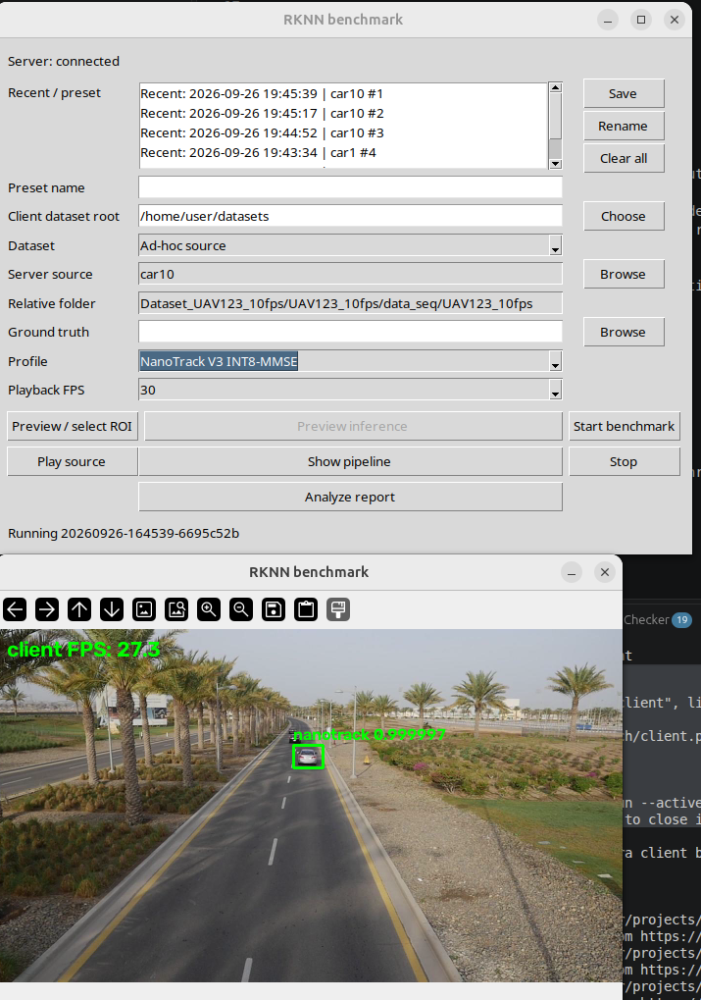

# bbox_bench

Metadata-paced client/server benchmarks for GStreamer ROI metadata. `bbox_bench`
uses the deployed `gst-rknn` runtime for plugins, models, diagnostics, and
datasets; it does not build or copy them.

## Install

The client and server are one wheel with optional dependencies:

```sh
pip install 'bbox-bench[client]'
pip install 'bbox-bench[server]'
```

For a source checkout, use uv and retain system GStreamer/PyGObject packages:

```sh
uv venv --system-site-packages
uv sync --extra client
uv run --active bbox-bench-client
```

## Deploy to Radxa

Run `scripts/deploy-radxa.sh`. It copies the checkout to the configured Radxa
host and installs the `server` extra into
`/home/radxa/bbox_bench/.venv`. The server reads models, plugins, and datasets
from `runtime_root: /home/radxa/gst-rknn` and saves runs below
`/home/radxa/bbox_bench/runs`.

Run `scripts/preflight.sh` on the Radxa before starting the server:

```sh
scripts/preflight.sh
```

## Usage

### Server

On the Radxa, start the server either directly or through its wrapper:

```sh
.venv/bin/bbox-bench-server
# or
scripts/run-server.sh
```

### Client

On the desktop, start the client:

```sh
uv run --active bbox-bench-client
```

The Radxa server runs one selected tracker/detector pipeline at a time and sends
only metadata over UDP. The client decodes its matching local dataset and renders
the returned ROIs. For tracker runs, the client saves one local report folder per
run containing `metadata.json` and raw per-frame `tracker.csv`; a later analysis
step can compare that data against the ground-truth file recorded in the metadata.

The server browser roots at `$runtime_root/datasets`; by default this is
`/home/radxa/gst-rknn/datasets`. Configure another runtime location with
`--config`. Both programs log colourized diagnostics with timestamp, model,
source line, and exception traceback.

The client keeps its existing preset file at
`~/.config/gst-rknn/nanotracker-benchmark-last-run.yaml` for compatibility.

---


